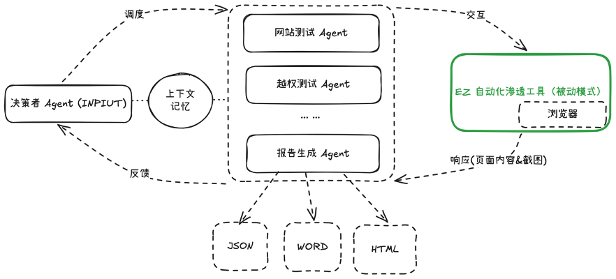

# EZ AI Agent Demo - 体验版 / Demo Version 🚀

**请注意：这是一个 EZ AI Agent 的演示版本 (Demo)，旨在供您测试和体验部分核心功能。当前版本并非完整产品，功能和稳定性可能有限。**

本演示项目展示了 EZ AI Agent 如何应用于网站渗透测试。它利用 EZ 强大的被动扫描能力，并结合多 Agent 协作框架，以提升渗透测试效率。

**核心特性 (Demo 版本)**

* **底层执行层:**
    *  **EZ 被动扫描引擎:**  负责基础漏洞检测，提供可靠的漏洞发现能力。
    *  **Browser-Use 驱动:**  模拟浏览器交互，覆盖更广泛的应用场景。
    *  **Steel 沙箱:**  确保浏览器环境隔离，保障测试安全。

* **智能调度层:**
    *  **DeepSeek (或其他 LLM 大模型) Orchestrator:**  作为智能调度中心，实时分析扫描结果、页面内容和历史数据，动态调度测试 Agent，优化测试流程。

* **多 Agent 协作 (部分功能演示):**
    *  **网站测试 Agent:**  模拟用户操作，覆盖业务场景，进行功能性测试。
    *  **漏洞验证 Agent (越权测试演示):** 基于视觉模型对比权限差异，辅助越权漏洞的验证。
    *  **报告生成 Agent:**  结合 EZ 工具的被动扫描结果和 Agent 渗透测试报告，自动生成全面的测试报告。
    *  **更多 Agent 敬请期待...**  (后续版†本将包含更多专业的渗透测试 Agent)

## 使用说明 (Demo 版本)

**请按照以下步骤体验 EZ AI Agent Demo 的基本功能。**

```bash
EZ_AI_AGENT
.
├── ez_ai_agent_demo
├── ez_target
├── ez_tools # EZ 自动化渗透测试工具目录
├── steel-browser
├── init.sql
├── LICENSE
├── README.md
├── docker-compose.yaml
└── .env # 配置文件

```

### 1. 启动 EZ 被动扫描功能 (EZ Passive Scanning) 

>  **重要提示**：**请务必先下载 EZ 工具，并配置好证书。**  这是启动 EZ 被动扫描功能的前提。

将 EZ 工具和证书放置于 `ez_tools` 文件夹下。

详细配置和介绍请参考 `ez_tools` 目录下的 README.md 文件。

```bash
cd ez_tools

./ez webscan --listen 0.0.0.0:9999 --disable-pocs web-brute --pocs beta-common-fileupload,php-path-disclosure,sqldet,beta-sqldet,php-realpath-leak
```


### 2.  配置环境变量(.env)

在 `.env` 文件中配置 AI 大模型的 `api_key` 和 `base_url`。

还需配置 EZ 工具被动代理的端口，由于被动代理需要 docker 网络访问使用，因此**需要使用本机的内网地址**而不是 localhost.

**大模型 api 申请和注意事项**

国内可以使用`腾讯云`或`deepseek`等平台申请`api_key`，使用其提供的 `deepseek`模型。

对于 browser-use 的调用，Google 的 `gemini-2.0-flash` 模型速度和精准度优于`deepseek-chat(v3)`，且提示词在`gemini-2.0-flash`模型上进行了优化，因此采用`gemini`模型会有更好的体验。

Gemini Api 申请地址(需科学上网)：https://aistudio.google.com/

> **国内可以使用 腾讯云 或 deepseek 平台** 申请 `api_key`，并使用其提供的 `deepseek` 模型进行体验。

deepseek 模型无法开启 browser-use 的视觉模型，效果减半。(browser-use 使用 deepseek 模型时，请将 USE_VISION 设置为 False)


### 3. 启动靶场 (Target Environment) 和 智能体(Agent)

```bash
docker compose up
```
靶场地址 (Target Website)：http://内网IP地址:8089  (请将 "内网IP地址" 替换为您的实际内网 IP 地址)


### 4. 开始自动化渗透测试 (Start Penetration Testing)

1.  **访问用户界面 (Access UI):**  打开浏览器，访问 http://127.0.0.1:5173/
2.  **输入目标地址 (Enter Target Address):**  在 `Logs` 选项卡中，输入您的靶场地址 (例如：http://本机内网地址:8089)。
3.  **开始测试 (Start Testing):**  点击 "开始测试" 按钮。

### 5. 演示视频

下面是 EZ AI Agent 演示版的操作视频，可以帮助您了解系统的基本工作流程：

<video src="pic/demo.mov" width="100%" controls></video>

下图展示了 EZ AI Agent 的整体架构设计：



---

**期待更多功能？关注 EZ 团队！**

**本次演示仅为您展示 EZ AI Agent 的冰山一角。后续版本将拥有更强大的功能、更智能的 Agent 协作和更全面的渗透测试能力。**

**如果您对 EZ AI Agent 的完整功能感兴趣，或者希望了解 EZ 团队的更多产品和动态，请持续关注我们的后续更新！**

**感谢您的体验！**

## 参考的开源项目
- https://github.com/mainframecomputer/orchestra
- https://github.com/browser-use/browser-use/
- https://github.com/steel-dev/steel-browser
- ...


## License
[ GPL-3.0](./LICENSE)

---

Made with ❤️ by the EZ Team.